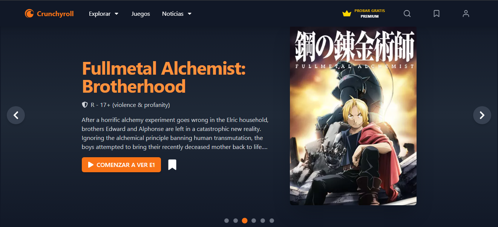

# Crunchyroll Clone

Un clon inspirado en Crunchyroll que permite a los usuarios explorar animes populares, leer noticias relacionadas y más. La aplicación está desarrollada con **React**, utiliza **Tailwind CSS** para el diseño y la API de **Jikan** para obtener los datos de anime. Además, está optimizada para funcionar offline mediante un **Service Worker**.

## Características

- Explorar animes populares utilizando la API de Jikan.
- Leer noticias y actualizaciones relacionadas con animes.
- Diseño responsivo gracias a **Tailwind CSS**.
- Soporte offline mediante **Service Workers** y almacenamiento en caché.
- Navegación fluida con **React Router DOM**.

## Tecnologías utilizadas

- **React**: Biblioteca para construir interfaces de usuario.
- **Vite**: Herramienta de desarrollo y empaquetado rápido.
- **Tailwind CSS**: Framework para estilos CSS.
- **Axios**: Para manejar peticiones HTTP.
- **Jikan API**: Fuente de datos para animes.
- **React Router DOM**: Para la navegación.
- **Vite PWA**: Para implementar Progressive Web Apps (PWA).

## Instalación

Sigue estos pasos para clonar y configurar el proyecto localmente:

### Prerrequisitos

- Node.js (versión 18 o superior)
- npm o yarn instalado

### Pasos

1. **Clonar el repositorio**:

   ```bash
   git clone https://github.com/tu-usuario/crunchyroll-clone.git
   cd crunchyroll-clone
   ```

2. **Instalar dependencias**:

   ```bash
   npm install
   # o
   yarn install
   ```

3. **Iniciar el servidor de desarrollo**:

   ```bash
   npm run dev
   # o
   yarn dev
   ```

4. **Abrir en el navegador**:

   Ve a [http://localhost:5173](http://localhost:5173) para ver la aplicación en acción.

### Construir para producción

Para generar una versión optimizada del proyecto:

```bash
npm run build
# o
yarn build
```

Los archivos generados estarán en la carpeta `dist`.

### Previsualizar la versión construida

Puedes previsualizar la build generada localmente con:

```bash
npm run preview
# o
yarn preview
```

## Estructura del proyecto

```plaintext
crunchyroll-clone/
├── public/             # Archivos públicos (favicon, manifest, etc.)
├── src/                # Código fuente
│   ├── assets/         # Recursos estáticos
│   ├── components/     # Componentes reutilizables
│   ├── pages/          # Páginas principales
│   ├── App.jsx         # Punto de entrada de la aplicación
│   ├── main.jsx        # Configuración principal
├── package.json        # Dependencias y scripts
├── tailwind.config.js  # Configuración de Tailwind CSS
├── vite.config.js      # Configuración de Vite
├── README.md           # Documentación del proyecto
```

## Uso offline

Este proyecto está configurado como una Progressive Web App (PWA). Una vez que los datos y recursos han sido cargados, puedes:

1. Usar la aplicación incluso sin conexión a Internet.
2. Ver los datos de la API de Jikan que ya hayan sido visitados previamente gracias al almacenamiento en caché.

## Contribución

Si deseas contribuir:

1. Haz un fork del repositorio.
2. Crea una nueva rama:

   ```bash
   git checkout -b feature/nueva-funcionalidad
   ```

3. Realiza tus cambios y haz un commit:

   ```bash
   git commit -m "Agrega nueva funcionalidad"
   ```

4. Sube los cambios:

   ```bash
   git push origin feature/nueva-funcionalidad
   ```

5. Abre un pull request en GitHub.

---

## **SEO y Metadatos**

Este proyecto incluye optimización básica para motores de búsqueda (SEO) y redes sociales:

- **Meta etiquetas**: Título, descripción, palabras clave.
- **Open Graph**: Optimización para compartir en redes sociales.
- **Twitter Card**: Tarjetas optimizadas para Twitter.

---

## **Despliegue**

El proyecto está diseñado para desplegarse fácilmente en plataformas como [Vercel](https://vercel.com/).

### Pasos para desplegar:

1. Configura una cuenta en Vercel.
2. Conecta tu repositorio desde GitHub.
3. Configura el comando de construcción en Vercel:

   ```bash
   npm run build
   ```

4. Configura el directorio de salida como `dist/`.
5. Haz clic en "Deploy" y accede al enlace generado.

---

## **Capturas**



---

## **Contribuciones**

¡Las contribuciones son bienvenidas! Si encuentras algún problema o tienes ideas para mejorar el proyecto, no dudes en abrir un **issue** o enviar un **pull request**.

---

## Licencia

Este proyecto está bajo la Licencia MIT. Consulta el archivo `LICENSE` para más información.
